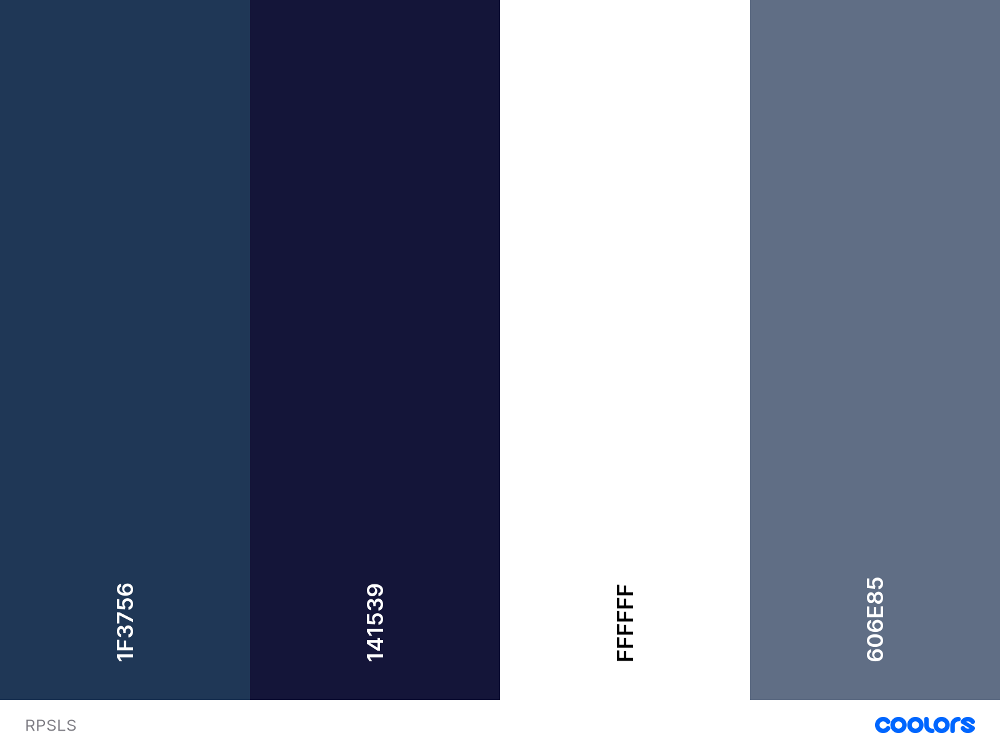

<h1 id="return-to-the-top"><a href="https://rpsls-game-six.vercel.app/" alt="Try the game!">Rock, Paper, Scissors, Lizard, Spock game</a></h1>
<h2>Ibrahim Murphy</h2>

<h1>The Why</h1>

Rock Paper Scissors Lizard Spock is the extended version of the game Rock Paper Scissors, popularised on the show <a href="https://www.youtube.com/watch?v=Kov2G0GouBw">The Big Bang Theory.</a> The site’s goal is to provide a challenging game to entertain, but also educate online users, into the rules/workings of the game.

<h1>User Experience(UX)</h1>
<h2>Target Audience</h2>
<ul>
<li>People who enjoy easy-to-play online games.</li>
<li>People wanting to learn the rules of Rock, Paper, Scissors, Lizard, Spock.</li>
<li>People of all ages.</li>
</ul>

First time user:

<ol>
<li>As a user I would like to play a competitive online game.</li>
<li>As a user I would like to be able to learn the rules of the game.</li>
<li>As a user I want the application to be easy to play and easy to navigate.</li>
</ol>

Returning User:

<ol>
<li>I would want to be able to navigate the site with ease.</li>
<li>I would want to be able to remember how to use the play the game with ease.</li>
</ol>

As a site creator:

<ol>
<li>I want to make the game to be interactive, fun and intuitive.</li>
<li>I want to ensure there is a challenging aspect of the game for the user.</li>
<li>I want to make sure the user learns the rule of the game quickly.</li>
</ol>
<h2>User Stories</h2>
<h2>Strategy</h2>

Create an interactive, fun game that is easy to pick up and play. The aim is provide consistent styling across all pages ensuring that the application runs flawlessly across all major devices. The code should be intuitive read and allow for updates to be made easily, for those wishing to implement improved features in future.

<ul>
<li>To provide a fun and interactive game application.</li>
<li>The user should have a target to win the game.</li>
<li>The user should be able to learn the rules of the game quickly.</li>
</ul>

<h2>Scope</h2>

The scope of Rock, Paper, Scissors, Lizard, Spock game in its first release is defined by the following features:

<ol>
<li>Functioning RPSLS game</li>
<li>Fully responsive design</li>
<li>Ability to keep a scoring system</li>
<li>A game over ending state</li>
<li>Rules overlay to explain the game</li>
</ol>

Features to be considered for future releases:

<ol>
<li>A scoreboard system (local storage) to keep how many wins you can get in a row</li>
<li>A best of 3, 5, 7 option</li>
<li>Ability to play against another human player online</li>
</ol>
<h2>Structure</h2>

The structure for the application has been designed to allow for the user to pick up and play quickly. The buttons and the game should be intuitive, so the user doesn't have a high learning curve.

<ul>
<li>Landing page
<ul><li>Landing page copy which introduces the user to website they've landed on</li>
<li>There will be 2 buttons; one denoting the genesis of the game and one the begins the game</li>
</ul></li>
</ul>
<ul>
<li>Main game
<ul>
<li>Game logo at the top of page</li>
<li>Scoring copy which keeps the current points score</li>
<li>Main canvas with the 5 icon options of Rock, Paper, Scissors, Lizard, Spock</li>
<li>Rules button that opens in an overlay</li>
</ul></li>
</ul>
<ul>
<li>Results page
<ul>
<li>Scoring copy which keeps the current points score</li>
<li>Main canvas with user selection and computer selection, with copy/animation of winner</li>
<li>Rules button that opens in an overlay</li>
</ul></li>
</ul>

<h2>Skeleton</h2>
<h3>Wireframes</h3>

Desktop:
<ul>
<li><a href="assets/images/designs/desktop-step-1-bonus.jpg">Step 1</a></li>
<li><a href="assets/images/designs/desktop-step-2-bonus.jpg">Step 2</a></li>
<li><a href="assets/images/designs/desktop-step-3-bonus.jpg">Step 3</a></li>
<li><a href="assets/images/designs/desktop-step-4-bonus.jpg">Step 4</a></li>
<li><a href="assets/images/designs/desktop-rules-modal-bonus.jpg">Rules</a></li>
</ul>

Mobile:

<ul>
<li><a href="assets/images/designs/mobile-step-1-bonus.jpg">Step 1</a></li>
<li><a href="assets/images/designs/mobile-step-2-bonus.jpg">Step 2</a></li>
<li><a href="assets/images/designs/mobile-step-3-bonus.jpg">Step 3</a></li>
<li><a href="assets/images/designs/mobile-step-4-bonus.jpg">Step 4</a></li>
<li><a href="assets/images/designs/mobile-rules-modal-bonus.jpg">Rules</a></li>
</ul>

<h3>Colours</h3>

The colours that will be used throughout the site for its main styling are shown below:  The colours have been chosen to complement one another in a way which allows for the copy/icons to be easily viewed. A suggested colour scheme was also provided as part of the <a href="https://www.frontendmentor.io/challenges/rock-paper-scissors-game-pTgwgvgH">Frontend Mentor challenge.</a>

<h3>Typography</h3>

The fonts used were:<ul><li>
<a href="https://fonts.google.com/specimen/Barlow+Semi+Condensed" target="">Font Family: [Barlow Semi Condensed]</a></li><li>
Font Weights: 600, 700 </li></ul>

<h3>Images & Icons</h3>

Images and icons for the game, were provided as part of design assets from the <a href="https://www.frontendmentor.io/challenges/rock-paper-scissors-game-pTgwgvgH">Frontend Mentor challenge.</a> 

<h1>Features</h1>
<h2>Current Features</h2>

<ul>
<li>Human vs Computer mode</li>
<li>First to five wins</li>
<li>Random computer select</li>
<li>A game over ending state</li>
<li>Rules overlay to explain the game</li>
</ul>

<h2>Future Features</h2>

<li>A scoreboard system (local storage) to keep how many wins you can get in a row</li>
<li>A best of 3, 5, 7 option</li>
<li>Ability to play against another human player online</li>
<li>More interactive content/images when a winner of a round is decided</li>
<li>Day Mode which changes colour palette of game</li>

<h1>Technologies</h1>
<h2>Languages</h2>

Thd game utilises HTML5, CSS3, Java and JavaScript programming languages.

<h2>Other Technologies, Frameworks & Libraries</h2>

<li><a href="https://www.gitpod.io/" target="_blank">Gitpod</a> - The project was created and developed using the open sourced platform Gitpod</li>
<li><a href="https://github.com/" target="_blank">GitHub</a> - This project used GitHub allow access to the project code and store the project remotely.</li>
<li><a href="https://fonts.google.com" target="_blank">GoogleFonts</a> - Google Fonts was used to style the font for the project</li>
<li><a href="https://coolors.co/1f3756-141539-ffffff-606e85" target="_blank">Coolers</a>- for colour palette</li>
<li><a href="http://ami.responsivedesign.is/" target="_blank">Am I responsive design website</a> - for the preview images across different devices</li>
<li><a href="https://www.frontendmentor.io/challenges/rock-paper-scissors-game-pTgwgvgH"  target="_blank">Frontend Mentor</a> - for the challenge, providing icon assets and wireframe for the game</li>

<h1>Testing</h1>

<h2>Validator testing</h2>

<a href="https://validator.w3.org/" target="_blank">HTML Validator</a> 
The HTML has been tested with the HTML W3 validator and <a href="" target="_blank">passed</a> with no errors. Only one warning surrounding heading order.  

<a href="https://jigsaw.w3.org/css-validator/" target="_blank">W3C CSS validator</a> 
The CSS has been tested with the W3C CSS validated and <a href="" target="_blank">passed</a> with no errors.  

<a href="https://jshint.com/" target="_blank">JS Hint</a> 
The game JS file has been passed through JSHint and does not show any errors.

Chrome Dev Tools - Lighthouse
For running the lighthouse tests, I used an incognito window to avoid any errors and issues that could be caused by any of my Chrome extensions.
<h2>Tests</h2>
<table>
  <tr>
    <th>Screen size</th>
    <th>Chrome </th>
    <th>Brave</th>
      <th>Firefox</th>
  </tr>
  <tr>
    <td>Mobile</td>
    <td>Tick</td>
    <td>Tick</td>
      <td>Not tested</td>
  </tr>
  <tr>
    <td>Desktop</td>
    <td>Tick</td>
    <td>Tick</td>
      <td>Tick</td>
  </tr>
  <tr>
    <td>Tablet</td>
    <td>Not tested</td>
    <td>Not tested</td>
      <td>Not tested</td>
  </tr>
<h2>Bugs & Fixes</h2>

TBC

<h1>Deployment</h1>
<h2>GitHub Pages</h2>

TBC

<h2>Forking Repository</h2>

TBC

<h2>Cloning the project</h2>

TBC

<h1>Credits</h1>

TBC

<a href="#return-to-the-top" alt="Return to the top">RETURN TO THE TOP</a>