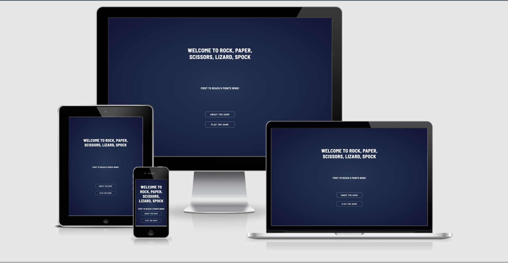

<h1 id="return-to-the-top"><a href="https://rpsls-game-six.vercel.app/" alt="Try the game!">Rock, Paper, Scissors, Lizard, Spock game</a></h1>
<h2>Ibrahim Murphy</h2>

<h1>The Why</h1>

Rock Paper Scissors Lizard Spock is the extended version of the game Rock Paper Scissors, popularised on the show <a href="https://www.youtube.com/watch?v=Kov2G0GouBw">The Big Bang Theory.</a> The site’s goal is to provide a challenging game to entertain, but also educate online users, into the rules/workings of the game.

<h1>User Experience(UX)</h1>
<h2>Target Audience</h2>
<ul>
<li>People who enjoy easy-to-play online games.</li>
<li>People wanting to learn the rules of Rock, Paper, Scissors, Lizard, Spock.</li>
<li>People of all ages.</li>
</ul>

First time user:

<ol>
<li>As a user I would like to play a competitive online game.</li>
<li>As a user I would like to be able to learn the rules of the game.</li>
<li>As a user I want the application to be easy to play and easy to navigate.</li>
</ol>

Returning User:

<ol>
<li>I would want to be able to navigate the site with ease.</li>
<li>I would want to be able to remember how to use the play the game with ease.</li>
</ol>

As a site creator:

<ol>
<li>I want to make the game to be interactive, fun and intuitive.</li>
<li>I want to ensure there is a challenging aspect of the game for the user.</li>
<li>I want to make sure the user learns the rule of the game quickly.</li>
</ol>
<h2>User Stories</h2>

Create an interactive, fun game that is easy to pick and play. The aim is provide consistent styling across all pages ensuring that the application runs flawlessly across all major devices. The code should be intuitive read and allow for updates to be made easily, for those wishing to implement improved features in future.

<h2>Strategy</h2>

TBC

<h2>Scope</h2>

TBC

<h2>Structure</h2>

TBC

<h2>Skeleton</h2>

TBC

<h3>Wireframes</h3>

TBC

<h2>Surface</h2>

TBC

<h3>Colours</h3>

TBC

<h3>Typography</h3>

TBC

<h3>Images & Icons</h3>

TBC

<h1>Features</h1>
<h2>Current Features</h2>

TBC

<h2>Future Features</h2>

TBC

<h1>Technologies</h1>
<h2>Languages</h2>

TBC

<h2>Other Technologies, Frameworks & Libraries</h2>

TBC

<h1>Testing</h1>

TBC

<h2>Tests</h2>

TBC

<h2>Bugs & Fixes</h2>

TBC

<h1>Deployment</h1>
<h2>GitHub Pages</h2>

TBC

<h2>Forking Repository</h2>

TBC

<h2>Cloning the project</h2>

TBC

<h1>Credits</h1>

TBC

<a href="#return-to-the-top" alt="Return to the top">RETURN TO THE TOP</a>